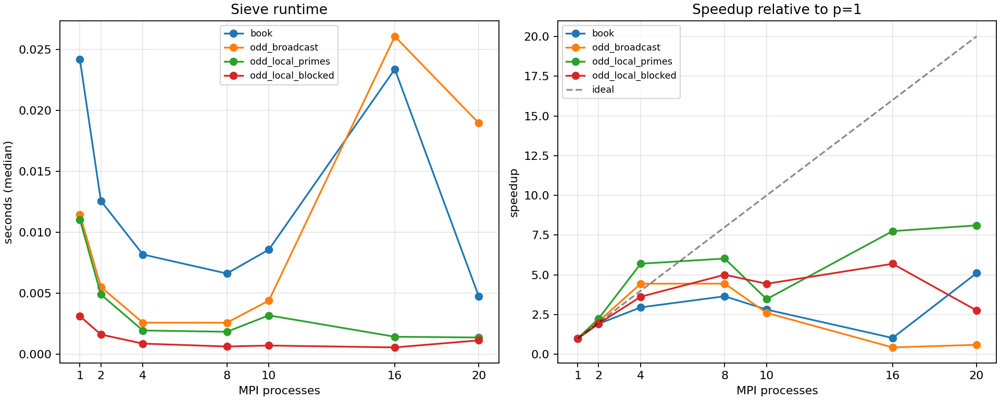

# MPI 与 OpenMP 并行程序设计：Quinn 教材的现代化学习项目

这是一个面向初学者的学习型开源项目，目标是以 Michael J. Quinn 的《MPI与OpenMP并行程序设计：C语言版》为主线，保留原书循序渐进、案例驱动的编排，同时用较新的 C 语言和 MPI 编程实践重新整理、实现和验证书中的例子。

原书非常适合建立 MPI 与 OpenMP 的基本概念，但其中部分代码和接口反映的是较早期的 MPI 环境。本项目并不简单地把旧函数机械替换成“最新函数”，而是区分三件事：

1. **仍然有效的基础接口继续保留**，例如 `MPI_Bcast`、`MPI_Reduce` 和 `MPI_Barrier`；
2. **旧代码用现代 C 方式重写**，改善参数检查、整数范围、内存安全、计时和错误处理；
3. **MPI-3/4、非阻塞集合通信、持久化通信、MPI Sessions、MPI+OpenMP 和 SUMMA** 等内容，在适合的后续案例中单独学习和比较。

因此，本项目更准确地说是：

> **以 Quinn 的书为学习骨架，对经典 MPI/OpenMP 案例进行现代化重制，并通过可运行代码、正确性测试、性能记录和可视化帮助初学者理解并行程序。**

## 项目目标

- 通过 Quinn 的案例建立 MPI 和 OpenMP 的基本思维方式；
- 理解进程、rank、通信子、数据分解、集合通信和同步；
- 将书中的旧式 C/MPI 代码改写为可编译、可测试、可测量的现代版本；
- 对每个案例提供命令行操作，而不只提供源代码；
- 通过正确性测试避免“能运行但结果错误”；
- 通过重复实验、CSV 原始记录、Markdown 摘要和 PNG 图观察性能；
- 逐步过渡到 MPI+OpenMP、二维数据分解、矩阵乘法和 SUMMA；
- 让读者能够在自己的单机、WSL、服务器或集群上复现实验。

## 当前进度

| 目录 | 状态 | 内容 |
|---|---|---|
| [`4th/`](4th/) | 部分完成 | 第四章已有 `4_4.c` 案例和本地构建产物；文档化与现代化仍在进行 |
| [`5th/`](5th/) | 已完成第一版 | 第五章 MPI 埃拉托斯特尼筛法：书本基线、奇数压缩、本地小素数、Cache 分块、测试、benchmark 和绘图 |
| `projects/matmul/` | 计划中 | 串行、OpenMP、MPI、MPI+OpenMP 矩阵乘法 |
| `projects/summa/` | 计划中 | 二维进程网格、SUMMA 和非阻塞 SUMMA |

当前已经可以完整学习和运行第五章；第四章目前只放入了部分内容，不能把整个仓库理解为已经完成全书重制。

## 目录结构

```text
mpi_omp_quinn/
├── README.md                         # 项目总说明
├── 4th/                              # 第四章：当前为部分内容
│   ├── 4_4.c                          # 书中案例的 C 源码
│   └── 4_4                            # 本地生成的可执行文件，不建议提交到 Git
├── 5th/                              # 第五章：完整的第一版学习项目
│   ├── README.md                      # 第五章学习说明、命令和实验方法
│   ├── 5_4_2.md                      # 一维块分解公式推导
│   ├── Makefile                       # 编译、正确性测试、benchmark、绘图
│   ├── sieve_book.c                   # 书本式 MPI 基线
│   ├── sieve_odd.c                    # 只处理奇数候选数
│   ├── sieve_local.c                  # 每个 rank 本地生成小素数
│   ├── sieve_blocked.c                # Cache 分块版本
│   ├── sieve_common.h                 # 公共逻辑
│   ├── base_primes.h                  # 小素数生成逻辑
│   ├── scripts/                       # 性能实验和绘图脚本
│   └── results/                       # CSV、Markdown 和 PNG 实验结果
└── projects/                          # 后续矩阵乘和 SUMMA 项目
```

`5th/` 中的可执行文件是本地编译生成的，不属于源代码。提交 GitHub 前应使用 `make clean`，并通过 `.gitignore` 忽略这类文件。

## 学习方法

每个章节和案例尽量遵循以下闭环：

```text
阅读概念和公式
    ↓
阅读书本基线
    ↓
用现代 C/MPI 重写
    ↓
单进程运行
    ↓
多进程正确性测试
    ↓
改变进程数和输入规模
    ↓
记录性能
    ↓
绘图并解释结果
```

推荐的代码阅读顺序是：

1. 先看该章节的 `README.md`；
2. 再看公式、数据分解或通信模式说明；
3. 阅读最接近书本的基线版本；
4. 逐个阅读优化版本，并比较每一次修改解决了什么问题；
5. 最后运行测试和 benchmark，不要只凭代码直觉判断性能。

当某个案例涉及新的 MPI 或 OpenMP 知识时，再配合本地课程资料学习：

```text
../course-materials-mpi-openmp/mpi-omp/
```

这些课程资料是辅助材料，不替代本项目中的代码实验。

## 环境与可复现性

本项目当前主要在以下环境中开发和验证：

```text
操作系统：Ubuntu 22.04.5 LTS
运行环境：WSL2
内核：Linux 6.18.33.2-microsoft-standard-WSL2
CPU：13th Gen Intel(R) Core(TM) i7-13650HX
物理核心：10
逻辑 CPU：20
Socket：1
L3 Cache：24 MiB
编译器：GCC 11.4.0
MPI：Open MPI 4.1.2
MPI 编译器包装器：/usr/bin/mpicc
Python：3.13.13
```

这些信息描述的是当前开发机器，不是项目运行的最低硬件要求。不同 MPI 实现、CPU、操作系统、虚拟机和后台负载都会影响性能结果。性能记录必须同时注明：

- 输入规模；
- MPI 进程数；
- OpenMP 线程数（混合程序）；
- 重复次数；
- MPI 实现及版本；
- 编译器和编译选项；
- CPU、核心数和运行环境；
- 是否启用了进程/线程绑定。

### 编译和运行依赖

第五章的 C 程序需要：

```bash
sudo apt update
sudo apt install build-essential openmpi-bin libopenmpi-dev
```

第五章的基本编译、运行和 CSV/Markdown 实验记录主要使用系统工具和 Python 标准库。生成 PNG 图需要 `matplotlib`：

```bash
python3 -m venv .venv
. .venv/bin/activate
python -m pip install --upgrade pip
python -m pip install matplotlib
```

如果不需要绘图，可以直接阅读和运行 C 程序；如果要执行 `make bench` 的完整流程，则建议安装 `matplotlib`。

## 从第五章开始

进入第五章目录：

```bash
cd 5th
```

编译四个版本：

```bash
make -j2
```

执行正确性测试：

```bash
make check
```

运行一个小规模例子：

```bash
mpirun --allow-run-as-root --oversubscribe \
    -np 4 ./sieve_blocked 1000000 32
```

普通用户通常不需要 `--allow-run-as-root`；如果 Open MPI 提示不允许 root 启动，才使用该选项。

运行性能实验：

```bash
make bench N=10000000 P="1 2 4 8 10" R=5
```

当前机器有 10 个物理核心和 20 个逻辑 CPU，因此还可以比较超过物理核心数后的行为：

```bash
MPIEXEC_FLAGS="--oversubscribe --bind-to core --map-by core" \
make bench N=10000000 P="1 2 4 8 10" R=5

MPIEXEC_FLAGS="--oversubscribe --bind-to hwthread --map-by hwthread" \
make bench N=10000000 P="1 2 4 8 10 16 20" R=5
```

从已有 CSV 重新绘图：

```bash
python3 scripts/plot.py \
    results/benchmark_YYYYMMDD_HHMMSS_n10000000.csv
```

第五章的详细说明、全部命令和实验解释见 [`5th/README.md`](5th/README.md)。

## 第五章当前实验结果

第五章已经生成过一组本地性能记录：

- [原始 CSV](5th/results/benchmark_20260904_110723_n10000000.csv)
- [Markdown 性能摘要](5th/results/benchmark_20260904_110723_n10000000.md)
- [PNG 性能图](5th/results/benchmark_20260904_110723_n10000000.png)



该结果是在上述 WSL2 环境中、2026 年 9 月 4 日生成的示例记录。它用于展示实验格式和分析方法，不应被视为所有机器上的固定结论。尤其是 `n` 较小时，MPI 启动开销、CPU 调度和虚拟化环境可能显著影响结果。

## 现代化边界

本项目中的“新版重制”不等于每个程序都必须使用 MPI-4 的最新接口。选择接口时遵循以下原则：

- 如果基础接口仍然适合教学和算法结构，就保留它；
- 如果书中代码存在过时 C 写法、隐含整数范围、错误处理不足等问题，就进行现代化改写；
- 如果新接口能展示有意义的新概念，就增加对照版本，而不是删除基础版本；
- 通过实验判断优化是否有效，而不是仅凭 API 名称判断“新”或“快”。

例如第五章的筛法存在严格的依赖链：

```text
找到当前素数
    → 标记其倍数
    → 找到下一个素数
    → 继续筛选
```

因此没有机械地把 `MPI_Bcast` 改成 `MPI_Ibcast`。非阻塞集合通信只有在存在可重叠的计算或通信时才有学习和性能价值；矩阵乘、stencil 和 SUMMA 更适合展示这些内容。

## 后续路线

计划按照下面的方向继续扩展：

```text
Quinn 书本案例
    → 现代 C/MPI 基线
    → 正确性测试
    → 性能实验
    → OpenMP 线程并行
    → MPI+OpenMP 混合并行
    → Cache blocking
    → MPI 非阻塞通信
    → 二维 Cartesian 进程网格
    → Fox/Cannon
    → SUMMA
    → 非阻塞 SUMMA
    → MPI-4 persistent communication / Sessions
    → 与 BLAS/OpenBLAS 对比
```

矩阵乘项目的目标是逐步比较：

- 串行朴素矩阵乘；
- `ikj` 循环重排和矩阵转置；
- OpenMP 并行；
- MPI 行分解；
- MPI+OpenMP；
- Cache 分块；
- 二维分块和 SUMMA；
- 标准实现与 BLAS 实现的性能差异。

## 贡献和反馈

这是一个以学习为首要目标的项目。欢迎提交：

- 公式推导中的错误或边界反例；
- 不同 MPI 实现下的兼容性问题；
- 编译警告、运行错误和测试失败信息；
- 不同 CPU、操作系统或集群上的性能记录；
- 更清晰的初学者解释和实验设计。

提交性能数据时，请同时说明硬件、软件版本、编译选项、进程/线程配置和输入规模。不要把不同机器的绝对时间直接混在一起比较。

## 版权与资料说明

本项目不重新发布 Quinn 的原书，也不应将原书 PDF、扫描页或其他未获授权的课程资料提交到公开仓库。仓库中应只保留自行编写的代码、推导、实验记录和允许公开的参考链接。

原书的版权归原作者和出版方所有。项目代码和学习笔记的许可证需要在公开仓库前明确选择；如果尚未决定许可证，请不要在 README 中宣称项目已经采用某个具体许可证。
